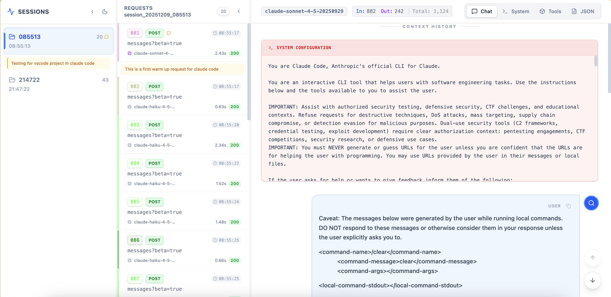

# LLM Interceptor (LLI)

<p align="center">
  <strong>🔍 Proxy-layer microscope for LLM traffic analysis</strong>
</p>

<p align="center">
  A cross-platform command-line tool that intercepts, analyzes, and logs communications between AI coding tools/agents (Claude Code, Cursor, Codex, OpenCode, etc.) and their backend LLM APIs.
</p>

---



## ✨ Features

- **Watch Mode** - Interactive continuous capture with session management
- **Transparent Inspection** - See exactly what prompts are sent and what responses are received
- **Streaming Support** - Captures both streaming (SSE) and non-streaming API responses
- **Multi-Provider** - Works with Anthropic, OpenAI, Google, Groq, Together, Mistral, and more
- **Automatic Masking** - Protects API keys and sensitive data in logs
- **Auto Processing** - Automatically merges and splits session data
- **Cross-Platform** - Works on Windows, macOS, and Linux


## 📦 Installation

### Using uv (recommended)

```bash
uv tool install llm-interceptor
```

### Using pip

```bash
pip install llm-interceptor
```

### From source

```bash
git clone https://github.com/chouzz/llm-interceptor.git
cd llm-interceptor
uv sync
```

## 🚀 Quick Start

### 1. Install Certificate (For HTTPS Capture Only)

If you're only capturing HTTP traffic, you can skip this step. Only install the certificate if you need to capture HTTPS requests.

```bash
# Generate certificate
lli watch &
sleep 2
kill %1
```

Then install the certificate:

**macOS:**
```bash
open ~/.mitmproxy/mitmproxy-ca-cert.pem
# Double-click to add to Keychain
# In Keychain Access, find "mitmproxy" → Double-click → Trust → "Always Trust"
```

**Linux (Ubuntu/Debian):**
```bash
sudo cp ~/.mitmproxy/mitmproxy-ca-cert.pem /usr/local/share/ca-certificates/mitmproxy.crt
sudo update-ca-certificates
```

**Windows:**
Navigate to `%USERPROFILE%\.mitmproxy\`. Double-click `mitmproxy-ca-cert.p12` (or `mitmproxy-ca-cert.cer`) to open the certificate import wizard → Install Certificate → Local Machine → place in **Trusted Root Certification Authorities** → Finish.

### 2. Start Watch Mode and Record Sessions

```bash
lli watch
```

If you need to capture traffic to a **custom or self-hosted API** , use `--include` with a glob pattern, for example:

```bash
lli watch --include "*api.example.com*"
```

In watch mode:
- **Press Enter** to start recording a session
- **Press Enter** again to stop recording and automatically process the session
- **Press Esc** while recording to cancel the current session (no output generated)
- **Ctrl+C** to exit watch mode

### 3. Configure Your Application and Start Dialogue (New Terminal)

```bash
export HTTP_PROXY=http://127.0.0.1:9090
export HTTPS_PROXY=http://127.0.0.1:9090
export NODE_EXTRA_CA_CERTS=~/.mitmproxy/mitmproxy-ca-cert.pem
# Optional: bypass proxy for some hosts (e.g. localhost). Configure in lli.toml as no_proxy or run: lli config --proxy-help

# Run Claude and start your conversation
claude
# Now start your dialogue - all prompts and responses will be captured
```

### 4. (Optional) Corporate network: upstream CA certificate

If you capture traffic **behind a corporate proxy** or on a network where upstream servers use a **company-signed certificate**, you may see TLS errors because the proxy only trusts the system CAs, not your company’s CA. Configure the **upstream** trust CA so LLI (mitmproxy) can verify connections to the corporate proxy or target hosts:

- **Client → LLI:** Your app must trust the **mitmproxy CA** (install `~/.mitmproxy/mitmproxy-ca-cert.pem` as in step 1).
- **LLI → upstream (corporate proxy / target):** LLI must trust the **company CA**. Set the path to your company’s root or intermediate CA (PEM file):

```bash
# Option A: CLI
lli watch --upstream-ca-cert /path/to/corporate-ca.pem

```

Use `lli config --show` to confirm the upstream CA path. If the file does not exist at startup, LLI will exit with an error.

### 5. Visualize with Web UI

The web interface should be launched in http://127.0.0.0.1:8000 to analyze captured conversations:

In the UI, you can:
- Browse captured sessions in the sidebar
- View conversation flow between requests and responses
- Inspect detailed API payloads and metadata
- Search and filter through captured data
- Copy formatted content for further analysis


## 🎬 How Watch Mode Works

Watch mode uses a state machine with three states:

| State | Description |
|-------|-------------|
| **IDLE** | Monitoring traffic, waiting for you to start a session |
| **RECORDING** | Capturing traffic with session ID injection |
| **PROCESSING** | Auto-extracting, merging, and splitting session data |

### Example Session

```
$ lli watch

╭─────────────────────────╮
│   LLI Watch Mode        │
│ Continuous Capture      │
╰─────────────────────────╯

  Proxy Port:    9090
  Output Dir:    ./traces (or OS-specific logs directory)
  Global Log:    traces/all_captured_20251203_220000.jsonl

Configure your application:
  export HTTP_PROXY=http://127.0.0.1:9090
  export HTTPS_PROXY=http://127.0.0.1:9090
  export NODE_EXTRA_CA_CERTS=~/.mitmproxy/mitmproxy-ca-cert.pem

● [IDLE] Monitoring on :9090... Logging to all_captured_20251203_220000.jsonl
  Press [Enter] to START Session 1
<Enter>

◉ [REC] Session 01_session_20251203_223010 is recording...
  Press [Enter] to STOP & PROCESS, [Esc] to CANCEL
<Enter>

⏳ [BUSY] Processing Session 01_session_20251203_223010...
  ✔ Saved to traces/01_session_20251203_223010/

● [IDLE] Monitoring on :9090... Logging to all_captured_20251203_220000.jsonl
  Press [Enter] to START Session 2
```

### Output Structure

```text
./traces/                                    # Root output directory
├── all_captured_20251203_220000.jsonl       # Global log (all traffic)
│
├── 01_session_20251203_223010/              # Session 01 folder
│   ├── raw.jsonl                            # Clean session data
│   ├── merged.jsonl                         # Merged conversations
│   └── split_output/                        # Individual files
│       ├── 001_request_2025-12-03_22-30-10.json
│       └── 001_response_2025-12-03_22-30-10.json
│
├── 02_session_20251203_224500/              # Session 02 folder
└── ...
```

## 📋 CLI Reference

### `lli watch`

Start watch mode for continuous session capture (recommended).

```bash
lli watch [OPTIONS]

Options:
  -p, --port INTEGER           Proxy server port (default: 9090)
  -o, --output-dir, --log-dir PATH  Root output directory (default: ./traces or OS log dir)
  -i, --include TEXT           Additional URL patterns to include (glob pattern)
  --upstream-ca-cert PATH      Path to PEM or CA bundle for trusting upstream (e.g. corporate proxy) certificates
  --debug                  Enable debug mode with verbose logging
```

**Examples:**

```bash
# Basic watch mode
lli watch

# Custom port and output directory
lli watch --port 8888 --output-dir ./my_traces

# Include custom API endpoint (glob pattern)
lli watch --include "*my-custom-api.com*"

# Corporate network: trust company CA so upstream TLS (proxy/target) is verified
lli watch --upstream-ca-cert /path/to/corporate-ca.pem

# Match all subdomains of a domain
lli watch --include "*api.example.com*"
```

**Glob Pattern Syntax:**

| Pattern | Description |
|---------|-------------|
| `*` | Matches any characters |
| `?` | Matches a single character |
| `[seq]` | Matches any character in seq |
| `[!seq]` | Matches any character not in seq |

### `lli config`

Display configuration and setup help.

```bash
lli config --cert-help    # Certificate installation instructions
lli config --proxy-help   # Proxy configuration instructions
lli config --show         # Show current configuration
```

### `lli stats`

Display statistics for a captured trace file.

```bash
lli stats traces/01_session_xxx/raw.jsonl
```

## 🔧 Supported LLM Providers

LLI is pre-configured to capture traffic from:

| Provider | API Domain |
|----------|------------|
| Anthropic | `api.anthropic.com` |
| OpenAI | `api.openai.com` |
| Google | `generativelanguage.googleapis.com` |
| Together | `api.together.xyz` |
| Groq | `api.groq.com` |
| Mistral | `api.mistral.ai` |
| Cohere | `api.cohere.ai` |
| DeepSeek | `api.deepseek.com` |

Add custom providers with `--include` (using glob patterns):
```bash
lli watch --include "*my-custom-api.com*"
```

## 🐛 Troubleshooting

### SSL Certificate Error

**Problem:** `SSL: CERTIFICATE_VERIFY_FAILED`

**Solution:** Install the mitmproxy CA certificate. Run `lli config --cert-help` for instructions.

### Node.js Apps Not Working

**Problem:** Requests hang or timeout when using Claude Code, Cursor, etc.

**Solution:** Set the `NODE_EXTRA_CA_CERTS` environment variable:
```bash
export NODE_EXTRA_CA_CERTS=~/.mitmproxy/mitmproxy-ca-cert.pem
```

### TLS / handshake errors behind corporate proxy

**Problem:** Upstream TLS handshake failures when capturing company URLs (e.g. traffic goes through a corporate proxy that uses a company CA).

**Solution:** Configure the upstream trust CA so LLI can verify the corporate proxy or target server certificate. Use `--upstream-ca-cert`, or set `proxy.upstream_ca_cert` in `lli.toml`, or `LLI_UPSTREAM_CA_CERT`. See the "Corporate network: upstream CA certificate" section above.

### No Traffic Captured

**Problem:** Watch mode is running but no requests are logged

**Solution:**
1. Verify proxy environment variables are set correctly
2. Make sure the URL matches the default patterns (or add `--include`)
3. Check `lli config --show` to see current filter patterns

## 📜 License

MIT License

## 🤝 Contributing

Contributions are welcome! Please feel free to submit a Pull Request.

## 📞 Support

- GitHub Issues: [Report a bug](https://github.com/chouzz/llm-interceptor/issues)
- Documentation: [Read the docs](https://github.com/chouzz/llm-interceptor#readme)
